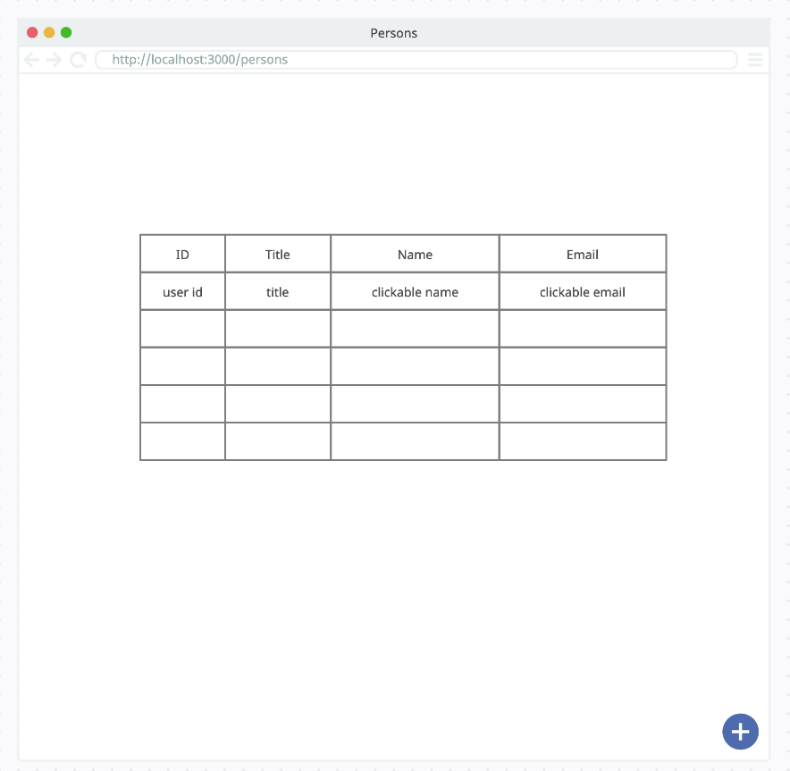
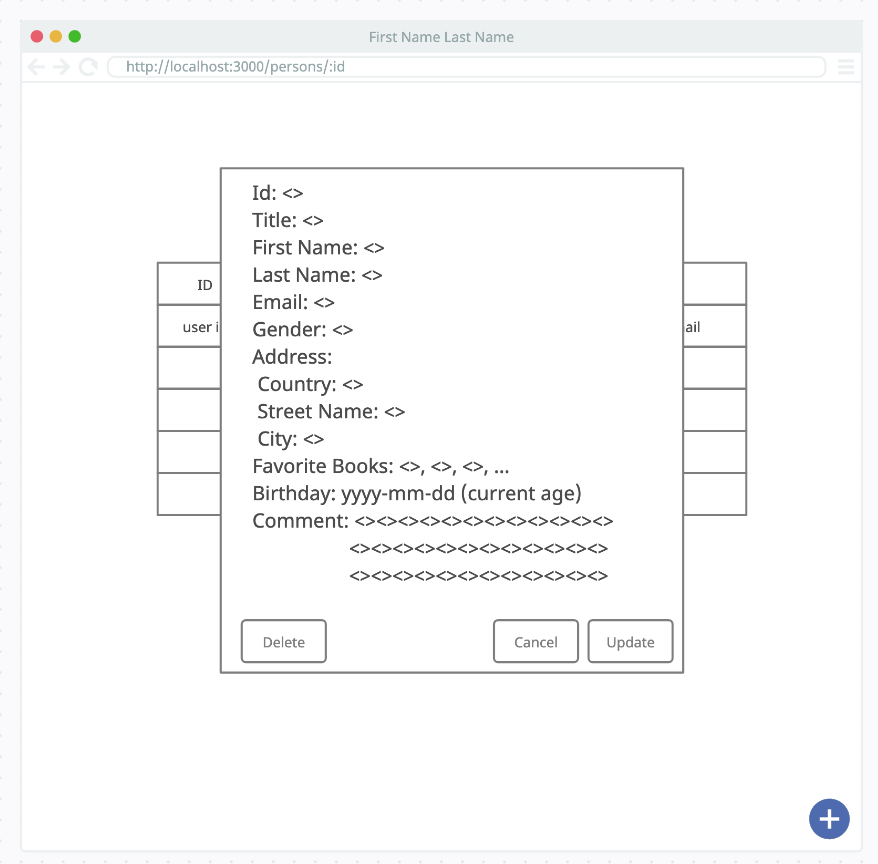

# Front-End interview challenge

Welcome to the Front-End interview coding challenge!

## Task

Create a React App with the following:

### `List View`



- Should show loading indication while loading data
- Should show error message if data could not be loaded

### `Details Modal`



- Should show loading indication while loading data
- Should show error message if data could not be loaded
- Should show loading indication while updating data
- Should show error indication if updating data fails
- Should show success indication if updating data succeeds
- Background color of the modal should be the same as the persons favorite color

### `Add Modal`


- Should show loading indication while adding/saving the person
- Should show error indication if adding data fails
- Should show success indication if adding data succeeds
- Close modal on successful adding of user

## How project will be judged

- Does it follow wireframe design? (prettiness is less important)
- Does it follow the requirements in this document?
- Is the code correctly formatted and easy to understand?
- Are requested functionality there?
- Are there any obvious bugs?

## Limitations

- Dependencies
  - You may install any dependency you like
  - You may not remove already installed dependencies
- There should not be any need to change any file in the `src/mocks` folder but you are of course allowed to look at the files in the folder.

## Available endpoints

All endpoints has the following response body on error:

```js
{
  errors: ["<Error message>"]
}
```

- ### `GET` "/persons?page=number"

  Returns a `200` response with the following response body:

  ```js
  {
    results: [
      {
        id: string,
        firstName: string,
        lastName: string,
        email: string,
        title: string
      },
    ],
    hasNextPage: boolean
  }
  ```

- ### `GET` "/persons/:id"

  Returns a `200` response with the the requested person.

  Example response body:

  ```js
  {
    "id": "6ad313a7d001e",
    "firstName": "Skippy",
    "lastName": "Dunkerley",
    "favoriteBooks": [
      "364186697-9",
      "475215020-4",
      "570912095-2",
      "640196807-9",
      "124026580-8"
    ],
    "email": "sdunkerley0@unblog.fr",
    "gender": "Male",
    "address": {
      "country": "Portugal",
      "streetName": "Russell",
      "postalCode": "4910-597",
      "city": "Vilarelho"
    },
    "title": "Honorable",
    "favoriteColor": "#864f45",
    "birthday": "2013-04-25",
    "comment": ""
  }
  ```

- ### `POST` "/persons"

  Require the following request body:

  ```js
  {
    "id": string,
    "firstName": string,
    "lastName": string,
    "favoriteBooks": [string],
    "email": string,
    "gender": string,
    "address": {
      "country": string,
      "streetName": string,
      "postalCode": string,
      "city": string,
    },
    "title": string,
    "favoriteColor": string,
    "birthday": string,
    "comment": string // optional
  }
  ```

  Returns a `200` response with the following response body

  ```js
  {
    "id": string,
    "firstName": string,
    "lastName": string,
    "favoriteBooks": [string],
    "email": string,
    "gender": string,
    "address": {
      "country": string,
      "streetName": string,
      "postalCode": string,
      "city": string,
    },
    "title": string,
    "favoriteColor": string,
    "birthday": string,
    "comment": string // optional
  }
  ```

- ### `PATCH` "/persons/:id"

  Require a request body with at least on of the following keys:

  - firstName
  - lastName
  - birthday
  - comment

  Example:

  ```js
  {
    firstName: string
  }
  ```

  Returns a `200` response with the following response body:

  ```js
  {
    "id": string,
    "firstName": string,
    "lastName": string,
    "favoriteBooks": [string],
    "email": string,
    "gender": string,
    "address": {
      "country": string,
      "streetName": string,
      "postalCode": string,
      "city": string,
    },
    "title": string,
    "favoriteColor": string,
    "birthday": string,
    "comment": string // optional
  }
  ```

- ### `DELETE` "/persons/:id"
  Returns a `204` response without a response body

## Available Scripts

In the project directory, you can run:

### `yarn start`

Runs the app in the development mode.\
Open [http://localhost:3000](http://localhost:3000) to view it in your browser.

Backend is mocked using MWS. The react app will be able to make successful API calls to the endpoints listed under `Available endpoints`

The page will reload when you make changes.\
You may also see any lint errors in the console.

### `yarn test`

Launches the test runner in the interactive watch mode.\
See the section about [running tests](https://facebook.github.io/create-react-app/docs/running-tests) for more information.
